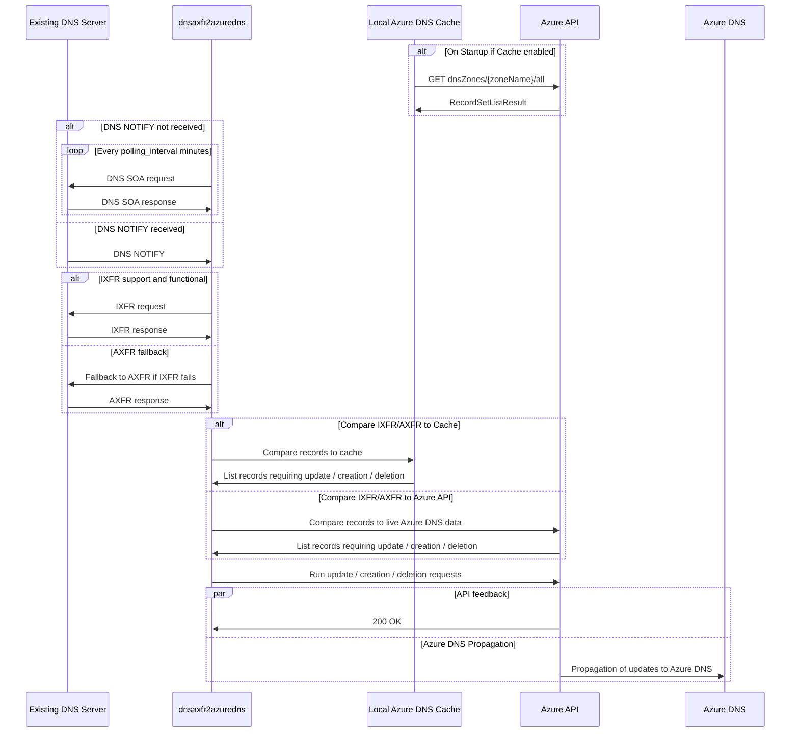

# dnsaxfr2azuredns
`dnsaxfr2azuredns` is a reponse to [Azure DNS](https://learn.microsoft.com/en-us/azure/dns/dns-overview) lack of [AXFR/IXFR](https://learn.microsoft.com/en-us/azure/dns/dns-overview) Zone transfer. This is a Java application that acts as a Slave DNS Server and synchronizes with Master DNS's, and then replicates modified data with Azure DNS.

This project is still in development and not yet fit for production nor fully documented.

# How to use this project

## Solution Design

Here is an example of workflow synchronizing one or more Master DNS Servers with Azure DNS.

## Running the DNSSlaveServerApp

`java -jar dnsaxfr2azuredns -`

# Contributing details

## Java version and Build tools

* Building the JAR application requires Maven 2.7+.
* Code is designed for Java SE 21.

## Project Dependencies

This project requires the following libraries:
* [dnsjava](https://github.com/dnsjava/dnsjava)
* [Azure SDK for Java](https://github.com/Azure/azure-sdk-for-java)

For `DNSSlaveServerApp` command line arguments:
* [Apache Commons CLI](https://commons.apache.org/proper/commons-cli/)

For JSON configuration processing:
* [json-schema-validator](https://github.com/networknt/json-schema-validator)
* [Google GSON](https://github.com/google/gson)