# axfr4azuredns
`axfr4azuredns` is a reponse to [Azure DNS](https://learn.microsoft.com/en-us/azure/dns/dns-overview) lack of support for [AXFR/IXFR](https://learn.microsoft.com/en-us/azure/dns/dns-faq#does-azure-dns-support-zone-transfers--axfr-ixfr--) Zone transfer.
This is a Java application that can act:
* As a Slave DNS Server which synchronizes with Master DNS's, and then replicates modified data with Azure DNS.
* Or as a Master DNS Server which synchronizes with Azure DNS, and then replicates modified data to a non-Azure, AXFR compatible DNS.

# Disclaimer

This project is not functional yet. Documentation currently represents the aim of the project.

Any available version for now stores passwords in cleartext in the JSON configuration, and in cleartext in memory. If this is a security concern for you, feel free to contribute to the project to add better security. Otherwise this will be addressed once functional.

# How to use this project

Intended use of this application is to allow transfer from a private DNS Zone hosted on any AXFR or IXFR compliant DNS Server (Windows Server DNS, bind, unbound...) to Azure DNS Zones.

It *might* be used to leverage Azure DNS as secondary DNS Server however in that case, DNSSEC cannot be enabled.

For now it was not design to allow 2-ways updates.

## Solution Design

Here is an example of workflow synchronizing one or more Master DNS Servers with Azure DNS.

```mermaid
sequenceDiagram
    participant EDNS as Existing DNS Server
    participant D2AD as axfr4azuredns
    participant AzDNSCache as Local Azure DNS Cache
    participant AzAPI as Azure API
    participant AzDNS as Azure DNS
    
    alt On Startup if Cache enabled
        AzDNSCache->>AzAPI: GET dnsZones/{zoneName}/all
        AzAPI->>AzDNSCache: RecordSetListResult
    end

    alt DNS NOTIFY not received
        loop Every polling_interval minutes
            D2AD->>EDNS: DNS SOA request
            EDNS->>D2AD: DNS SOA response
        end
    else DNS NOTIFY received
        EDNS->>D2AD: DNS NOTIFY
    end

    alt IXFR support and functional
        D2AD->>EDNS: IXFR request
        EDNS->>D2AD: IXFR response
    else AXFR fallback
        D2AD->>EDNS: Fallback to AXFR if IXFR fails
        EDNS->>D2AD: AXFR response
    end

    alt Compare IXFR/AXFR to Cache
        D2AD->>AzDNSCache: Compare records to cache
        AzDNSCache->>D2AD: List records requiring update / creation / deletion
    else Compare IXFR/AXFR to Azure API
        D2AD->>AzAPI: Compare records to live Azure DNS data
        AzAPI->>D2AD: List records requiring update / creation / deletion
    end

    D2AD->>AzAPI: Run update / creation / deletion requests

    par API feedback
        AzAPI->>D2AD: 200 OK
    and Azure DNS Propagation
        AzAPI->>AzDNS: Propagation of updates to Azure DNS
    end
```

## Running the DNSServerApp

1. Create a configuration file based on the [example.json](conf/example.json). For more information check [Configuration Documentation](conf/README.md)
2. Start the server using `java -jar axfr4azuredns.jar -c conf/settings.json`

# Contributing details

## Java version and Build tools

* Building the JAR application requires Maven 2.7+.
* Code is designed for Java SE 21 (may look into lower versions if functional).

## Project Dependencies

For testing and building:
- **JUnit Jupiter API**, Version: `5.11.1`
- **JUnit Jupiter Engine**, Version: `5.11.1`

For running:
- **Apache Commons CLI**, Version: `1.9.0`
- **Apache Commons Validator**, Version: `1.9.0`
- **Dev Harrel JSON Schema**, Version: `1.7.1`
- **Google Gson**, Version: `2.11.0`
- **Apache Mina**, Version `2.2.3`
- **SL4J API**, Version `2.0.16`
- **Cal10n** for localization, Version `0.8.1`
- **dnsjava**, Version `3.6.2`

For logging:
- **Log4j2 Core**, Version: `2.24.0`
- **Log4J2 for SLF4J2**, Version `2.24.0`
- **SLF4J API**, Version `2.0.16`
- **SLF4J Extensions**, Version `2.0.16`

# Todo List

The Todo list is available in [Github milestones](https://github.com/vivienbo/axfr4azuredns/milestones).
Don't hesitate to [report issues or feature requests](https://github.com/vivienbo/axfr4azuredns/issues).
And of course don't hesitate to contribute if you want to join.